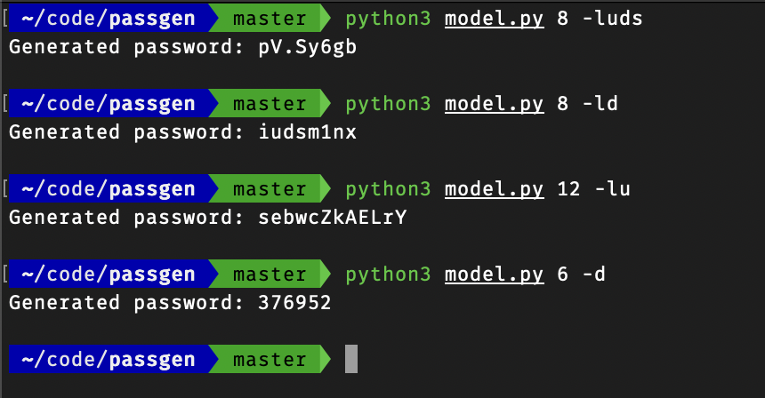

# Pypassgen

Pypassgen is Password Generator for Python3.

## How to install

Clone this repository and change directory by terminal

```bash
git clone https://github.com/haikal-dev/pypassgen.git
cd pypassgen
```


## Run model.py using python3

```bash
python3 model.py
```

Or

```bash
chmod +x model.py
```

```bash
./model.py
```

## How to use

Here are a few arguments you can use while running this program:

```
'l' - lowercase letters
'u' - uppercase letters
'd' - decimal numbers
's' - symbols
```

For example, if you want to generate an 8-character string containing lowercase letters, uppercase letters, and decimal numbers, you can use the following command:

```bash
python3 model.py 8 -lud
```


